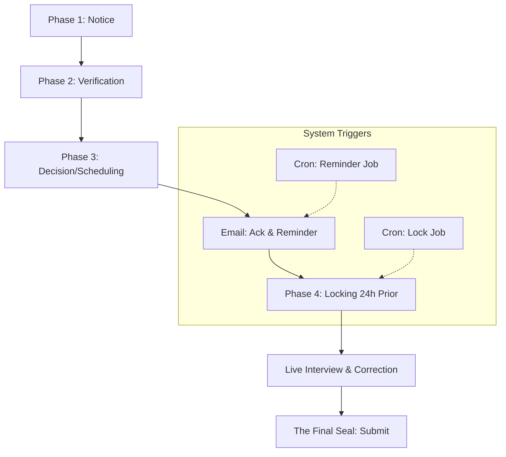

# Architecture: System Flow & Operations

This document describes the high-level architecture and the state machine governing the resignation process.

## 4-Phase Resignation Lifecycle

The "Refined Process Flow" ensures data integrity through a phased transition.

### Automation (Cron Jobs)
1. **Lock Mechanism** (`/api/cron/lock-resignation`):
   - Runs periodically (e.g., hourly).
   - Identifies resignations with `status: 'scheduled'` where the `scheduled_interview_date` is less than 24 hours away.
   - Updates status to `locked`, preventing employee edits.

2. **Reminders** (`/api/cron/reminders`):
   - Identifies resignations with `status: 'scheduled'` where the interview is ~48 hours away.
   - Sends the reminder email via Resend and marks `reminder_email_sent: true`.

### Core Server Actions
Located in `src/app/actions/`:
- **`resignation-ops.ts`**: Handles status transitions and email triggers (Ack, Approve, Decline).
- **`interview-ops.ts`**: Logic for "Live Correction" and final submission/locking.
- **`analytics.ts`**: Aggregation logic for Lead dashboards.
